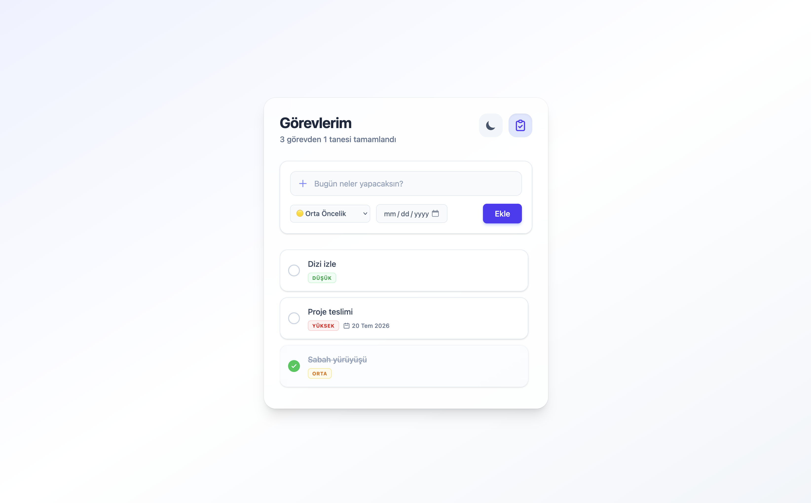
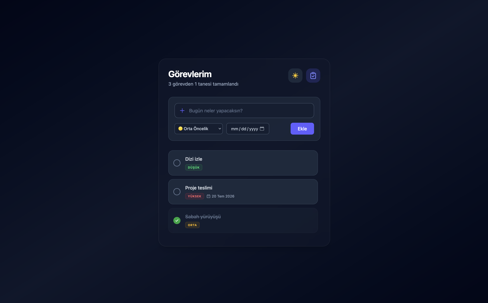
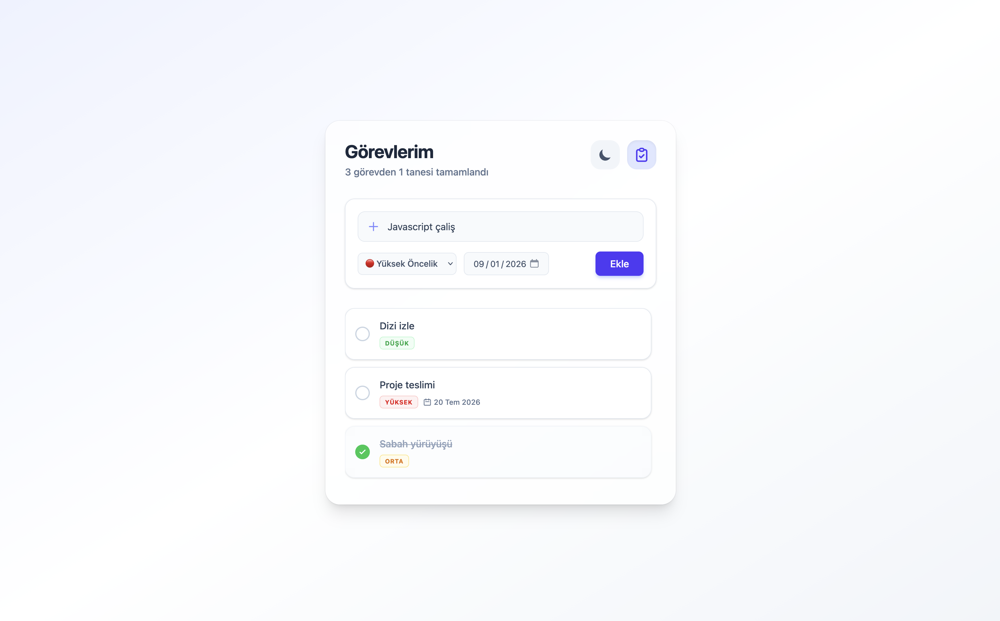

# 📝 Modern Görev Yöneticisi (Task Manager)

Web Geliştirme eğitimi proje yönergesi kapsamında geliştirilmiş; modern arayüze sahip, tamamen tarayıcı tabanlı (LocalStorage) çalışan bir görev yönetim uygulamasıdır. 

## 🚀 Özellikler

- **Gelişmiş CRUD İşlemleri:** Görev ekleme, listeleme, durum güncelleme (tamamlandı) ve silme işlemleri.
- **Veri Kalıcılığı:** Tarayıcı yenilense dahi veriler `LocalStorage` entegrasyonu sayesinde kaybolmaz.
- **Öncelik Seviyeleri:** Görevlere özel (Düşük, Orta, Yüksek) renkli ve dinamik etiketlendirme.
- **Bitiş Tarihi (Deadline):** Görevler için tarih belirleme ve takvim entegrasyonu.
- **Karanlık Tema (Dark Mode):** Kullanıcı tercihine göre tek tıkla değişen ve hafızada tutulan şık karanlık arayüz desteği.
- **Modern Proje Mimarisi:** Yönergeye tam uyumlu `Components`, `Pages` ve `Interfaces` izole klasör yapısı.

## 🛠️ Kullanılan Teknolojiler

- **Kütüphane/Çerçeve:** ReactJS (Vite Build Tool)
- **Dil:** TypeScript (Arayüz modelleri ve tip güvenliği)
- **Stil:** Tailwind CSS v4 (Utility-first modern tasarım)

## 📸 Ekran Görüntüleri

| Uygulama Önizlemeleri |
| :---: |
|  |
|  |
|  |

## 💻 Kurulum ve Çalıştırma

Projeyi bilgisayarınızda yerel olarak çalıştırmak için aşağıdaki adımları sırasıyla uygulayabilirsiniz:

1. Repoyu bilgisayarınıza klonlayın:
   ```bash
   git clone [https://github.com/ScnaNner/task-manager-app.git](https://github.com/ScnaNner/task-manager-app.git)